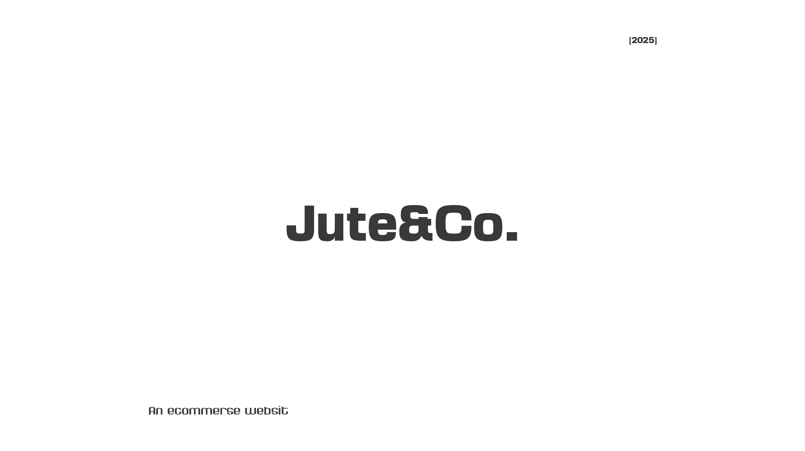

# Jute & Co.
> *Sustainable Living, Crafted by Hand.*



---

## 🌿 The Vision
**Jute & Co.** is not just an e-commerce platform; it is a digital sanctuary for sustainable living. Our improved digital experience is designed to bridge the gap between conscious consumers and the timeless artistry of jute craftsmanship. 

We moved away from the clutter of traditional e-commerce to create a **minimalist, narrative-driven interface** that lets the product—and the hands that made it—take center stage.

## 🎨 UI/UX Design Philosophy

### 1. Immersive Storytelling
We believe every product has a soul. Our UI is designed to tell that story.
- **Narrative-First Layouts:** Instead of infinite grids of commodities, we use editorial-style layouts that combine large, emotive imagery with poetic typography.
- **Micro-Interactions:** Subtle animations and hover effects breathe life into the browsing experience, making it feel organic and responsive, like the materials we sell.

### 2. A "Quiet" Interface
In a world of digital noise, Jute & Co. is a breath of fresh air.
- **Minimalist Aesthetic:** We use ample whitespace and a restrained color palette (Earth tones, Cream, Charcoal) to evoke a sense of calm and sophistication.
- **Typography:** Our font choices balance modern readability with the rustic elegance of heritage brands, ensuring that the text invites reading rather than scanning.

### 3. Seamless User Journey
Sustainability shouldn't mean sacrificing convenience.
- **Intuitive Navigation:** A streamlined menu structure helps users find what they need without getting lost in categories.
- **Dynamic 3D Carousel:** A centerpiece of our homepage, this interactive feature allows users to explore our featured collections in a spatial, engaging way.
- **Smooth Transitions:** Page transitions are fluid, mimicking the natural flow of fabric, ensuring the user never feels a harsh "cut" between experiences.

## ✨ Key Features

### The Artisan Showcase
We don't just sell bags; we introduce you to the makers. Our "Our Story" and product detail pages are dedicated to highlighting the craftsmanship and the human element behind every stitch.

### Sustainable & Transparent
The UI is designed to be transparent. Key sustainability metrics and material origins are not hidden in fine print but are presented as core features of the product display.

### Responsive & Accessible
Sustainable living is for everyone. Our design ensures a flawless experience across all devices—desktop, tablet, and mobile—without compromising the visual fidelity or the immersive nature of the design.

---

## 🛠️ For Developers

While this project is designed with a focus on experience, it is built on a robust modern stack:
- **Frontend:** React + Vite
- **Styling:** Tailwind CSS (Custom Configured for Brand Identity)
- **State Management:** React Context API
- **Animations:** Custom CSS & Framer Motion (planned)

### Getting Started

```bash
# Install dependencies
npm install

# Run the development server
npm run dev
```

---
*© 2025 Jute & Co. All Rights Reserved.*

## 📸 UI Showcase


*Immersive Home Experience*


*Curated Collections*


*Detail View*


*Seamless Checkout*
